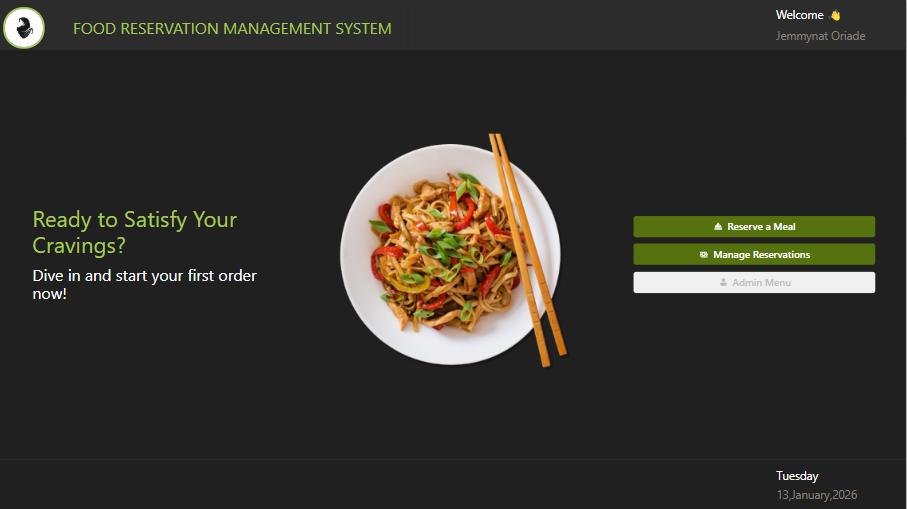
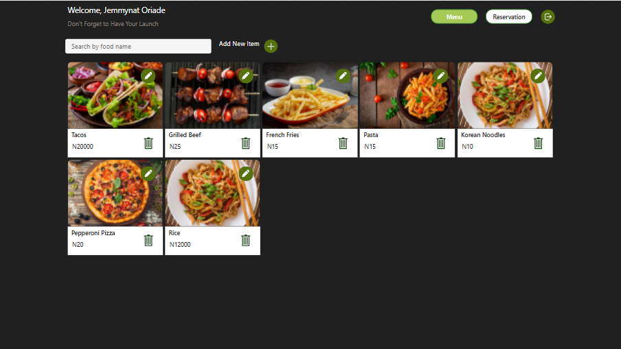
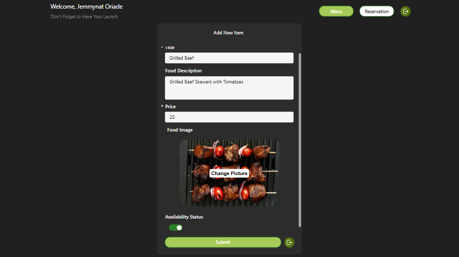
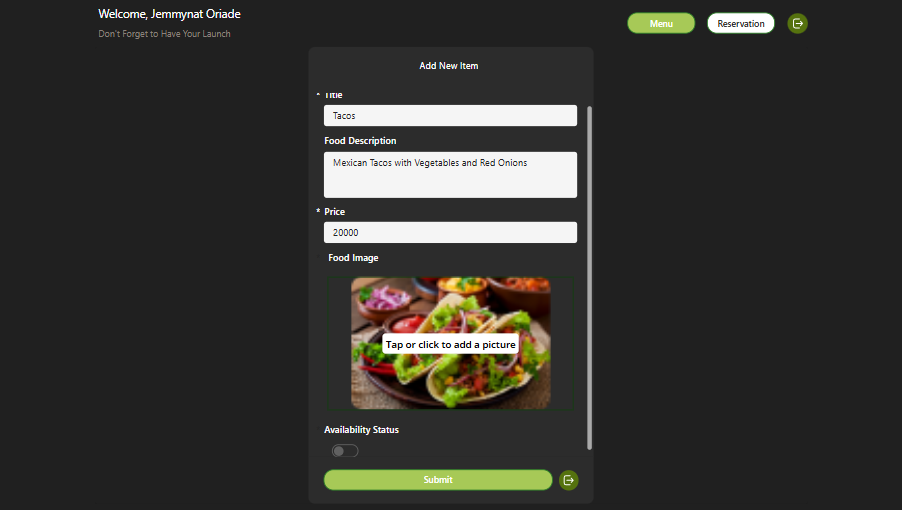
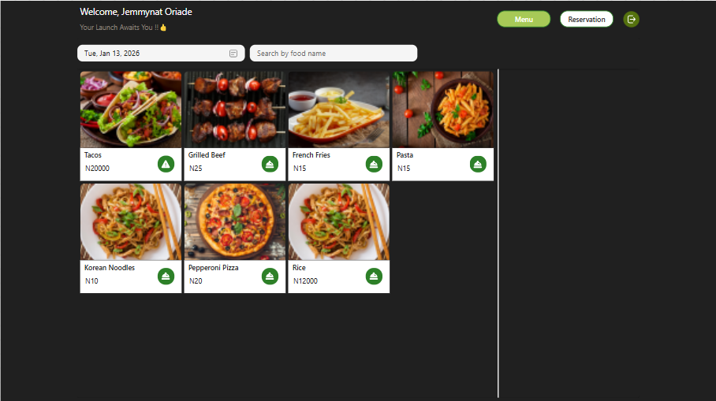
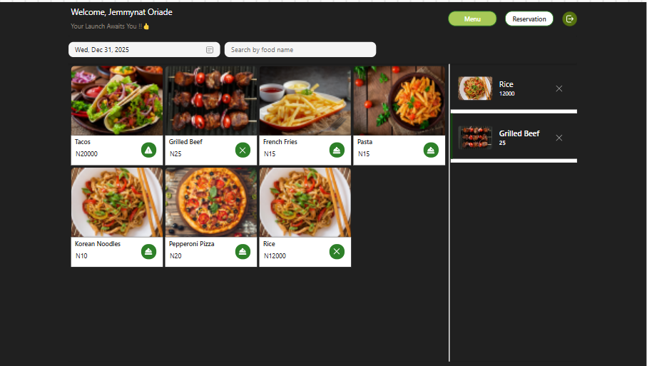

# 🍽 Food Reservation Management System

The Food Reservation Management System provides a centralized platform for managing food reservations with role-based access for administrators and employees. The solution improves visibility, reduces manual coordination, and ensures reservations are managed efficiently.

---

## 📌 Overview
A Power Apps–based food reservation management solution designed to streamline reservation handling, employee coordination, and administrative oversight using SharePoint as the data source.

---

## 🎯 Business Problem
Food reservation processes are often managed manually, leading to:
- Missed or duplicated reservations
- Limited visibility into reservation status
- Inefficient coordination between staff and administrators

---

## 💡 Solution
This solution was built using **Microsoft Power Apps**, **Microsoft Power Automate**, and **SharePoint** to deliver a centralized, automated reservation system that:
- Captures and manages food reservations centrally in real time
- Provide role-based access for administrators and employees
- Improve reservation status visibility and operational efficiency
- Automates confirmations and internal notifications

---

## 🧩 Application Screens

### 🏠 Home Screen
🔧 Functional Highlights
✅ Central navigation hub: Serves as the main entry point into the system, guiding users to all core features.
✅ Role-based access support: Includes an Admin Menu option, indicating separation of standard user and administrative functionality.
✅ Reserve a Meal – initiates the food reservation workflow.
✅ Manage Reservations – allows users to view their reservations and admins to view, update, or track all existing reservations.
✅ Personalized experience: Displays a welcome message with the logged-in user’s name, reinforcing user context and session awareness.
✅ Real-time context display: Shows the current day and date, improving usability and situational awareness.

### 🛠 Admin Screen
🔧 Functional Features
✅Menu Management Dashboard
   🧩Displays all available food items in a dynamic, responsive gallery.
   🧩Each food card shows: 
      *Food image 
      *Food name 
      +Price
      *Action icons (Edit & Delete)

✅Add New Food Item
   🧩“Add New Item” button launches a modal-style form (container popup) without navigating away from the screen.
   🧩Built using a context variable to control visibility, ensuring a smooth in-app experience.

✅Food Item Creation Form
   🧩Admins can input:
       *Food name
       *Food description
       *Price
       *Food image upload
       *Availability status (toggle control)
   🧩Submit button saves data directly to the SharePoint list.

✅Edit Existing Items
   🧩Each food card includes an edit icon.
   🧩Allows administrators to update menu details quickly.

✅Delete Functionality
   🧩Trash icon enables removal of menu items from the system.
   🧩Supports real-time data management.

✅Search Functionality
  🧩Search bar allows admins to filter food items by name.
  🧩Improves usability when managing large menus.

✅Navigation Control
   🧩Toggle buttons at the top allow switching between:
   🧩Menu view

### 📅 Reservation Screen
- Capture and manage food reservation details
- View reservation status and information
- Manage reservations and system data
- Oversee employees and reservation records

### 👥 Employee Screen
- Allows employees to view assigned reservations
- Supports operational coordination

---

## 🧩 Key Features
- User-friendly reservation interface (Power Apps)
- Centralized data storage (SharePoint)
- Automated notifications and status updates (Power Automate)
- Structured data model for scalability

---

## 🗃 Data Model (SharePoint)

The application uses **four SharePoint lists** as its data source:

- Reservation data
- Employee data
- Administrative records
- Supporting lookup/reference data

📄 Detailed table structure is documented in `/data/sharepoint-tables.md`

---

## ⚙️ Technology Stack
- Power Apps  
- Power Automate  
- SharePoint  
- Microsoft 365  

---

## 📈 Impact
- Reduced manual reservation handling
- Improved accuracy and visibility of bookings
- Faster response time to customer requests

---

## 🔗 Portfolio
This project is featured as a flagship solution in my personal portfolio website.

---

## 👩🏽‍💻 Author
**Jemmynat Omoshalewa Oriade**  
Power Platform Functional Consultant  

- GitHub: https://github.com/jemmynat  
- LinkedIn: https://linkedin.com/in/jemmynat-oriade  

